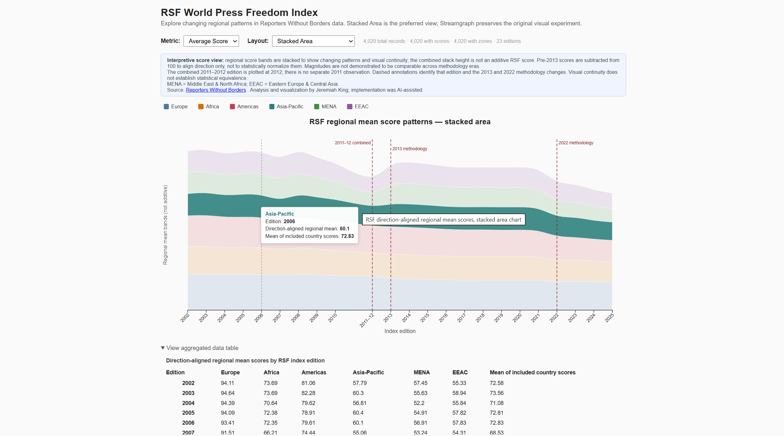

# RSF World Press Freedom Index — analytical visualization

This project began as a **#30DayChartChallenge** attempt to build a streamgraph
from [Reporters Without Borders (RSF) World Press Freedom Index](https://rsf.org/en/index)
data. Reconciling 23 historical exports exposed a more important story: code can
run and a chart can look convincing while its analysis is still wrong.

Historical schemas, labels, score direction, regional groupings, and methodology
all changed. AI-assisted implementations repeatedly produced plausible but
inaccurate results until human-led validation changed both the data treatment and
the visualization design. The repository name preserves the original experiment;
the current application uses stacked area as its preferred visual field:

- **Average Score** uses an intentionally interpretive stack to emphasize changing
  regional shape and continuity. Its total height is not an additive RSF score.
- **Country Count** is additive across six mutually exclusive project regions, so
  its stack also has a literal compositional meaning.

The original streamgraph remains available as a comparison for both metrics, but
its shifting baseline made regional evolution harder to perceive in this project.

The central lesson is: **valid code + attractive visualization ≠ valid analysis**.

**Live site:** https://unguisdraconis.github.io/rsf-streamgraph/



The bundled RSF exports are preserved unchanged. All interpretation and derived
analysis happens downstream in application code.

## Human and AI contributions

AI-assisted tools wrote most of the application and diagnostic implementation.
Jeremiah King developed and directed the downstream data-cleaning and analytical
approach, diagnosed repeated interpretation failures, directed the normalization
logic, validated the derived results, and made the final visualization and
interpretation decisions.

A later AI-assisted review recommended replacing the stacked Average Score view
with independent lines because regional averages are non-additive. Jeremiah
rejected that change because it optimized for precise numerical comparison rather
than the project's intended perceptual goal. The restored stacked-area view is
deliberate: the bands form an interpretive visual field, not an additive
statistical total. This is another part of the project's evidence that human
judgment was needed both to determine what the data mean and what the visualization
is for.

Earlier Python scripts used during exploration are no longer present. The retained
JavaScript diagnostics capture the claims needed by the current application. Git
authorship should not be read as evidence that the implementation was written
independently of AI assistance, nor that AI independently solved the data problem.

## What the application shows

The browser loads 23 semicolon-delimited CSV exports covering editions 2002–2010,
the combined 2011–2012 edition, and 2013–2025. The parser produces 4,020 unique
edition/ISO records and maps source labels into six project regions: Europe,
Africa, Americas, Asia-Pacific, MENA, and EEAC.

The controls select the metric and visual layout:

| Metric        | Default form | Optional form          | Meaning                                                                       |
| ------------- | ------------ | ---------------------- | ----------------------------------------------------------------------------- |
| Average Score | Stacked area | Streamgraph comparison | Interpretive field of regional arithmetic means; stack height is not additive |
| Country Count | Stacked area | Streamgraph comparison | Number of included countries in each region                                   |

Hovering the chart reveals an exact value. The region legend supports pointer and
keyboard exploration, and the disclosure below the chart provides the same values
as a structured table.

### Why stacked area?

The original #30DayChartChallenge concept was a streamgraph. Jeremiah tested that
form against the actual historical data and found that its shifting baseline made
regional evolution harder to perceive. A stable-baseline stacked area produced a
clearer visual field for this project's goal, so it became the preferred layout
while the repository name and optional streamgraph preserve the design history.
This is a project-specific perceptual judgment, not a claim that stacked area is
universally superior.

The Average Score stack is intentionally interpretive rather than additive. Its
purpose is to show changing regional shape and continuity across the historical
RSF material; the total stack height should not be read as a summed RSF score.
Methodology annotations remain visible so graphical continuity is not mistaken for
statistical equivalence.

## Data reconciliation

The parser and application interpret several source inconsistencies without
rewriting the bundled files:

- **Changing schemas:** column names and widths vary, including `Score 2025` in
  the latest export. Columns are resolved by headers rather than fixed positions.
- **Multilingual and malformed labels:** French and English region names, damaged
  accents, punctuation variants, and truncated values are mapped to the six
  project regions.
- **Combined edition:** `2012.csv` identifies its year as `2011-12`. It is one
  combined edition, represented internally at 2012; there is no separate 2011
  annual observation and no interpolated value.
- **2022 regional regrouping:** the source merged Eastern Europe and Central Asia
  into Europe. Application logic uses ISO evidence from adjacent editions to
  derive the project grouping of 40 Europe / 13 EEAC from the source grouping of
  53 Europe / 0 EEAC.
- **2025 encoding damage:** the raw file contains 219 Unicode replacement
  characters, including damaged multilingual country and region text. The raw
  export is preserved; region aliases allow all 180 rows to resolve, but the
  damaged display text has not been fully repaired.
- **Score direction:** earlier scores use the opposite better/worse direction from
  later scores. Pre-2013 values are displayed as `100 - score` only to align that
  direction.

### Score and methodology limitation

Direction alignment is **not** statistical normalization, recalibration, or proof
of a common scale. The combined 2011–2012 source ranges from -10 to 142; direction
alignment preserves the corresponding -42 to 110 range instead of clamping it to
0–100.

The application retains metadata for four methodology eras:

- 2002–2010;
- the combined 2011–2012 edition;
- 2013–2021; and
- 2022–2025.

The continuous area connects the available editions as an intentional visual-flow
device. The combined 2011–2012 edition is plotted at 2012; no separate 2011
observation is invented. Annotations identify that combined edition and the 2013
and 2022 methodology changes. Cross-era magnitudes should be treated cautiously:
visual continuity does not establish a statistically common scale. Modern
score-quality thresholds are not projected backward across historical
methodologies.

The RSF Index is itself interpretive, combining qualitative and quantitative
inputs whose methodology has changed over time; it should not be read as an
exhaustive objective count of press-freedom events. That limitation does not relax
source fidelity: parsing and reconciliation remain tested against the untouched
exports.

## Diagnostic evidence

Lightweight Node scripts preserve the investigation as executable evidence. They
test assumptions about schema changes, regional mappings, score direction, and
methodology boundaries in the interpretation layer; they do not modify the RSF
files:

- `check-2022-region-split.mjs` verifies the real 53/0 source grouping and the
  reconciled 40/13 Europe/EEAC result.
- `check-region-consistency.mjs` verifies 4,020 rows, 191 ISO entities, six known
  regions, and one stable project region per ISO after reconciliation.
- `check-score-direction.mjs` verifies the 2011–2012 raw and transformed extents
  and fails if a later edit silently clamps them.
- `parseCSV-safety.test.mjs` checks the full file/year manifest, unique
  edition/ISO keys, required score and region parsing, methodology segmentation,
  and the known 2025 encoding condition.
- `visual-intent.test.mjs` protects the stacked-area default, interpretive copy,
  methodology annotations, and accessible table/legend structure from accidental
  reversal.

Run them with:

```bash
npm run test:parser
npm run test:diagnostics
npm run test:visual
```

## Data provenance

The bundled RSF CSV exports are preserved unchanged. Parsing, schema
reconciliation, region normalization, score-direction alignment, methodology
segmentation, and aggregation are performed in the application rather than
written back into the source files. This keeps the source material intact while
making the project's analytical decisions explicit in code.

The files were downloaded directly from RSF. Their original Windows download
metadata records the RSF index page, direct export URL, and local download date;
those details are preserved in
[`public/data/README.md`](public/data/README.md) because NTFS alternate data
streams do not travel reliably with Git.

The original exports are retained unchanged and shared with attribution for this
non-commercial educational project. [RSF's published terms](https://rsf.org/en/methodology-used-compiling-world-press-freedom-index-2026)
authorize non-commercial sharing, copying, distribution, and communication of its
content while restricting modification or adaptation without consent. This
application reads the unchanged source files and generates its own analytical
structures and visualizations at runtime; it does not redistribute modified
versions of the source CSVs. This project description documents its design and
intended use, not a universal legal determination or a license for the repository.

## Quick start

Requires Node `^20.19.0 || >=22.12.0` (Vite 8).

```bash
npm ci
npm run dev
npm run test:parser
npm run test:diagnostics
npm run lint
npm run build
npm run preview
```

`npm run deploy` publishes the validated `dist/` output through the established
GitHub Pages workflow.

## Project structure

```text
public/data/          RSF CSV exports and tracked provenance notes
scripts/diagnostics/  focused corpus checks retained from analysis
src/App.jsx           data loading, controls, notes, and exact-value table
src/components/       D3 stacked-area and streamgraph rendering
src/utils/            parsing, region reconciliation, direction alignment
test/                 full-corpus parser regression checks
```

## Known limitations

- Reusers should review RSF's attribution, non-commercial-use, and
  no-modification terms for their own context.
- Historical methodology changes limit direct score comparison across eras.
- The 2025 source includes widespread encoding damage; only the fields required
  for the current regional analysis are robustly recovered.
- Browser, screen-reader, and other assistive-technology testing is incomplete.
- A screenshot/social preview and broader presentation polish remain future work.
- The repository intentionally has no added software license pending a separate
  licensing decision.

## Deployment architecture

`master` is the authoritative source branch. `gh-pages` is independent generated
publication output produced by the `gh-pages` package and should remain separate
from editable source history.

## Credits

Data and index methodology: [Reporters Without Borders](https://rsf.org/en/index).
Analytical approach, validation direction, and visualization decisions: Jeremiah
King. Application and diagnostic implementation: AI-assisted under Jeremiah's
direction and review.
